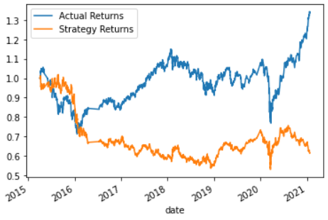
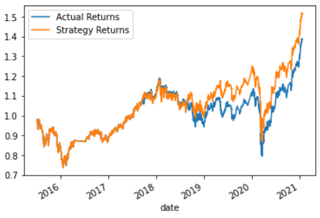
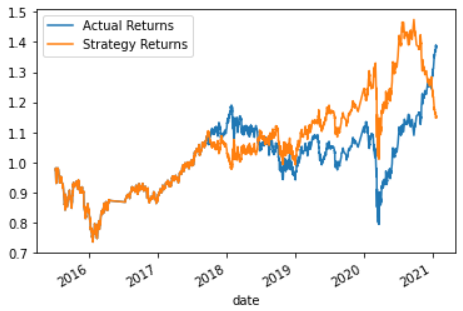

# machine_learning_training_bot
algorithmic trading bot with SVM learning functionality and model classification reporting

## baseline performance:
the deviation between actual and modeled returns in the chart below indicates poor efficacy of the baseline model

## SVC model
support vector classification vastly improves the fit, indicating a more causal relationship found between the training and testing data

## tuning the baseline model
tightening the training window and tweaking the SMA inputs resulted in some improvement but the model is still only showing predictive strength through limited slices of the time series

